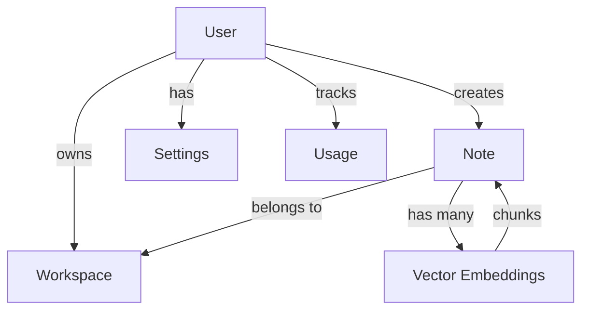

# AI Notes Backend API Documentation

Comprehensive API documentation for the AI Notes backend system - an intelligent note-taking platform with AI-powered features, semantic search, and collaborative editing.

## 🏗️ Architecture Overview

### Tech Stack
- **Backend**: NestJS, TypeScript, Prisma ORM
- **Database**: PostgreSQL with vector support (pgvector)
- **AI Services**: OpenAI GPT, Google Gemini (multiple providers)
- **Queue**: BullMQ for background processing  
- **Storage**: Cloudflare R2 + Local fallback
- **Real-time**: WebSockets for collaboration
- **Search**: Semantic vector search + full-text search

### Core Concepts

#### 🧠 AI-First Design
- **Vector Embeddings**: All notes are automatically embedded for semantic search
- **RAG (Retrieval-Augmented Generation)**: AI chat with context from your notes
- **Smart Categorization**: Auto-categorize notes based on content
- **Duplicate Detection**: AI-powered duplicate identification
- **Auto-Summaries**: Generate summaries and key points

#### 🏢 Multi-Workspace Architecture
- Users can have multiple workspaces (personal, work, etc.)
- Default workspace created automatically
- Workspace-scoped notes and sharing

#### 📝 Rich Note System
- Markdown-based content with full-text search
- Tag-based organization + AI categories
- Version control with change tracking
- File attachments with OCR support
- Location-aware notes (mobile)

### Base URL
```
Development: http://localhost:3001/api
Production: https://your-api-domain.com/api
```

## 📚 Documentation Structure

### Phase 1: Core Foundation ✅ **COMPLETED**

**🔐 Authentication System**
- ✅ Email/password + Google OAuth authentication
- ✅ JWT token management (7-day expiry)
- ✅ Automatic workspace and settings creation
- ✅ Secure password handling with bcrypt

**👤 User Management**
- ✅ Profile management with secure data scoping
- ✅ Profile updates (name, image)
- ✅ Password exclusion from responses

**🏢 Workspace System**
- ✅ Multi-workspace organization
- ✅ Default workspace auto-creation
- ✅ Workspace-scoped note management

**📝 Notes Core**
- ✅ Full CRUD operations with markdown support
- ✅ Tag-based organization system  
- ✅ Advanced text search across title/content/tags
- ✅ Automatic background RAG processing
- ✅ Soft deletion for data safety

**🔍 Vector Search & RAG**
- ✅ Semantic search using OpenAI embeddings (text-embedding-3-small)
- ✅ Intelligent text chunking (400 tokens, 30 overlap)
- ✅ Enhanced text search fallback when embeddings unavailable
- ✅ Context building for AI chat with citations
- ✅ Automatic processing triggers

**🤖 AI Chat System**
- ✅ Real-time streaming responses
- ✅ Multi-provider support (OpenAI, Gemini, Groq)
- ✅ RAG-powered context from user notes
- ✅ Citation tracking and source attribution
- ✅ Content suggestion system with apply functionality
- ✅ Vietnamese-optimized system prompts

**⚙️ Settings & Usage**
- ✅ AI model selection and configuration
- ✅ Token usage tracking and analytics
- ✅ User preference management
- ✅ Auto-reembedding settings

**🔧 Phase 1 Architecture Highlights:**
- **Security**: JWT auth, automatic user scoping, input validation
- **Performance**: Background processing, chunked embeddings, caching
- **Reliability**: Soft deletes, error handling, provider fallbacks
- **User Experience**: Streaming responses, auto-processing, smart defaults

---

### Phase 2A: Smart AI Features 🚧 **NEXT PHASE**
- **[Categories](./phase2a/01-categories.md)** - Auto-categorization with ML
- **[Duplicates](./phase2a/02-duplicates.md)** - Similarity detection & merging
- **[Relations](./phase2a/03-relations.md)** - Related notes discovery
- **[Summaries](./phase2a/04-summaries.md)** - Auto-generated summaries
- **[Search Enhancement](./phase2a/05-search.md)** - Advanced search & ranking

### Phase 2B: Collaboration & Sharing 📋
- **[Collaboration](./phase2b/01-collaboration.md)** - Real-time editing
- **[Sharing](./phase2b/02-sharing.md)** - Public links, permissions
- **[Versions](./phase2b/03-versions.md)** - Version control system
- **[Activities](./phase2b/04-activities.md)** - Audit logs, analytics
- **[Advanced Tags](./phase2b/05-tags.md)** - Structured tagging
- **[Templates](./phase2b/06-templates.md)** - Reusable note templates
- **[Attachments](./phase2b/07-attachments.md)** - File upload, OCR
- **[Notifications](./phase2b/08-notifications.md)** - Reminders, alerts

### Phase 3: Productivity & Mobile 🚀
- **[Tasks & Pomodoro](./phase3/01-productivity.md)** - Task management, focus timer
- **[Calendar Integration](./phase3/02-calendar.md)** - Events, scheduling
- **[Voice Notes](./phase3/03-voice.md)** - Speech-to-text, transcription
- **[Mobile Features](./phase3/04-mobile.md)** - Location notes, offline sync
- **[Export System](./phase3/05-export.md)** - PDF, Markdown, EPUB exports
- **[Review System](./phase3/06-review.md)** - Spaced repetition prompts

## 🗃️ Database Schema Overview

### Phase 1 Core Models


**Core Entities:**
- **User**: Authentication, profile, preferences  
- **Workspace**: Multi-tenant note organization
- **Note**: Markdown content with tags, soft-delete support
- **Vector**: Semantic embeddings for AI search (1536-dim OpenAI)
- **Settings**: AI model preferences, token limits
- **Usage**: Daily token consumption tracking

**Key Relationships:**
- User → Workspace (1:many, default workspace auto-created)
- Workspace → Note (1:many, workspace-scoped)
- Note → Vector (1:many, chunked content embeddings)
- User → Settings (1:1, auto-created with defaults)
- User → Usage (1:many, daily tracking records)

## 🔐 Phase 1 Security Model

### Authentication
- **JWT Tokens**: HS256, 7-day expiry, secure secret
- **OAuth Integration**: Google OAuth with proper scopes
- **Password Security**: bcrypt hashing, never returned in responses

### Authorization  
- **User Scoping**: All data automatically filtered by authenticated user
- **Workspace Isolation**: Notes scoped to user's workspaces
- **Resource Access**: No cross-user data access possible

### Data Protection
- **Input Validation**: Comprehensive DTOs with class-validator
- **SQL Injection**: Prevented by Prisma ORM
- **Soft Deletes**: Data recovery possible, vectors properly cleaned

## 🚀 Phase 1 Performance Features

### Background Processing
- **RAG Processing**: Automatic note embedding after creation/update
- **Chunking Strategy**: 400-token chunks with 30-token overlap
- **Queue System**: BullMQ for async processing

### Caching & Optimization
- **Vector Storage**: Efficient Float[] storage in PostgreSQL
- **Search Fallback**: Enhanced text search when embeddings unavailable
- **Context Building**: Token-optimized context for AI chat
- **Provider Fallback**: Automatic failover between AI providers

### Scalability Considerations
- **Connection Pooling**: Database connection optimization
- **Token Management**: Usage tracking and limits
- **Rate Limiting**: API endpoint protection
- **Streaming Responses**: Memory-efficient real-time chat

## 📊 Phase 1 Response Standards

### Success Responses
```json
{
  "success": true,
  "data": { /* response data */ },
  "message": "Operation successful",
  "timestamp": "2024-01-15T10:30:00.000Z"
}
```

### Paginated Responses
```json
{
  "success": true,
  "data": [ /* array of items */ ],
  "pagination": {
    "page": 1,
    "limit": 20,
    "total": 156,
    "pages": 8,
    "hasNext": true,
    "hasPrev": false
  }
}
```

### AI Responses
```json
{
  "success": true,
  "data": {
    "response": "AI generated content",
    "tokensUsed": 245,
    "model": "gpt-4",
    "confidence": 0.95,
    "sources": ["note_id_1", "note_id_2"]
  }
}
```

## 🧪 Phase 1 Testing Strategy

### Complete Integration Test
```typescript
// Test complete Phase 1 workflow
describe('Phase 1 Integration', () => {
  test('Complete user journey', async () => {
    // 1. Register user
    const auth = await register(testUser);
    expect(auth.access_token).toBeDefined();
    
    // 2. Auto-created resources
    const workspaces = await getWorkspaces(auth.access_token);
    const defaultWs = workspaces.find(w => w.isDefault);
    expect(defaultWs).toBeDefined();
    
    const settings = await getSettings(auth.access_token);
    expect(settings.model).toBe('gemini-1.5-flash');
    
    // 3. Create and process note
    const note = await createNote(auth.access_token, {
      title: "Test ML Note",
      content: "# Machine Learning\n\nAI concepts...",
      tags: ["ai", "test"],
      workspaceId: defaultWs.id
    });
    expect(note.id).toBeDefined();
    
    // 4. Verify RAG processing
    await waitForProcessing(); // Background job completion
    const vectors = await searchSemantic(auth.access_token, "machine learning");
    expect(vectors.length).toBeGreaterThan(0);
    
    // 5. Test AI chat
    const chatResponse = await chatComplete(auth.access_token, "Summarize my notes");
    expect(chatResponse.response).toContain("Machine Learning");
    expect(chatResponse.citations.length).toBeGreaterThan(0);
  });
});
```

---

**🎉 Phase 1: Foundation Complete!**

Phase 1 provides a solid foundation with:
- ✅ **Secure authentication** with OAuth support
- ✅ **Smart note management** with workspace organization  
- ✅ **AI-powered search** with vector embeddings
- ✅ **Intelligent chat** with RAG context
- ✅ **Content enhancement** with AI suggestions
- ✅ **Usage tracking** and preference management

**Ready for Phase 2A:** Advanced AI features like auto-categorization, duplicate detection, and related note discovery.

---

**Last Updated**: 2024-01-15  
**Schema Version**: 1.2  
**API Version**: 1.0 (Phase 1 Complete)
**Contact**: dev@ai-notes.com
